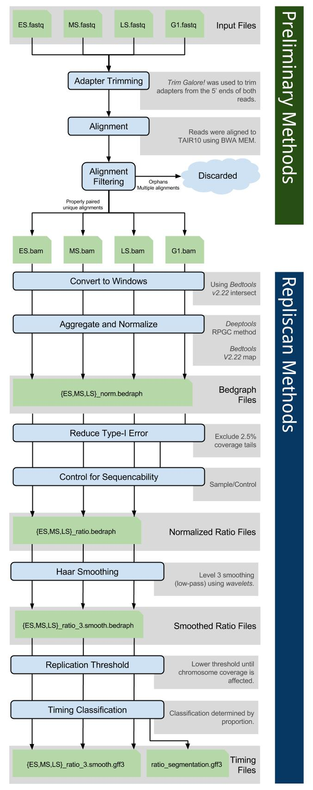

# Logfold Reptiming Pipeline
Pipeline for calculating reptiming enrichment and classifying the the time replication took place.

## Dependencies
The following binaries need to exist on the user's PATH:

1. bedtools - https://github.com/arq5x/bedtools2
   
   From Stampede/Lonestar @ TACC
   ```
   $ module load bedtools
   ```
2. samtools - https://github.com/samtools/samtools
   
   From Stampede/Lonestar @ TACC
   ```
   $ module load samtools
   ```
3. wavelets - http://staff.washington.edu/dbp/WMTSA/NEPH/wavelets.html
   
   Installation
   ```
   $ tar -xzf wavelets.tgz
   $ cd wavelets/src
   $ make
   $ cd ../bin
   $ cp wavelets [to somewhere on bin path]
   ```
## Methods



## Running the Pipeline

### Usage
```
repliscan.py [-h] -F FASTA [-L INT] [-S INT] [-C STR] [--use STR]      
             [--norm STR] [--rep STR] [-T Float] [-P Float] [--seg STR]
             [-t Float] [--low] [--plot] FILE
```

### Input TXT - FILE
Each line of the text file needs to contain a short name describing the sample and then a list of bam files corresponding to that name, all separated by tabs.

For example:

```
EX	example_rep_1.bam	example_rep_2.bam
```
The first line of this file needs to be the control (G1). All subsequent lines need to be listed sequentially according to experimental time. An example file would be:
```
G1	G1_001.bam	G1_002.bam
ES	ES_001.bam
MS	MS_001.bam	MS_L1.bam	MS_L2.bam
LS	LS.bam
```

### Arguments

| Flag | Option | Description - Bold denotes Default|
|:----:|:------:|:------------|
|`-F`|FASTA|The fasta file used for alignment ***Required***|
|`-L`|INT|The level of smoothing to use \[1,2,**3**,4,5\]|
|`-S`|INT|The size of each window in the bedgraphs - **1000**|
|`-C`|STR|How to handle replicates \(**sum**\)|
|`--use`|STR|Sequencability method to use for smoothing/segmentation \(log\|**ratio**\)|
|`--norm`|STR|Normalization Method \(DESeq\|**Coverage**\)|
|`--rep`|STR|Replicating Method \(threshold\|**auto**\|percent\)|
|`-T`|Float|Threshold Level \[-inf, inf\] - **0.0**|
|`-P`|Float|Percent Cut \[0,100\] - **2.0**|
|`--seg`|STR|Segmentation Method \(binary\|**proportion**\)|
|`--low`| |Fit a gamma distribution to coverage and remove the upper and lower 2.5% tails of coverage|
|`--plot`| |Plot Statistics|
|  |TXT| A text file listing bams for input ***Required***|

### Sequencability Method
There are two options to use with the `--use` flag for normalization of sequencability:
- `log` - log\(sample/control\) *Default*
- `ratio` - \(sample/control\)

### Normalization Methods
- `DESeq` - DESeq size normalization using geometric mean.
- `Coverage` - Transform each sample to 1X coverage across the genome. This replicates the RPGC normalization method from deepTools.

### Replication Methods
- `threshold` - A log(ratio) above threshold (T) is considered replicating.
- `auto` - Determine a log(ratio) threshold unique to each chromosome based on change in coverage.
- `percent` - log(ratio) values for each chromosome above percentile (P) are considered replicating.

### Segmentation Methods
- `binary` - Time classifications are combined on a binary basis.
- `proportion` - Time classifications are determined based on proportion.

### Handling Replicates
If you have replicates in your input file,
```
MS	MS_001.bam	MS_L1.bam	MS_L2.bam
```
you can specify the method by which they are aggregated with the `-C` paramter. This accepts the following methods:
  - sum (Default)                                    
  - median                                           
  - mean                                             
  - min                                              
  - max                                              

## Output
 - `*.bedgraph` - Bedgraph produced from corresponding bam (not normalized)
 - `*_(logFC|ratio).bedgraph` - Bedgraph of signal after dividing control and performing sequencability transform
 - `*(logFC|ratio)_*.smooth.bedgraph` - Smoothed using specified level of Haar wavelet
 - `*(logFC|ratio)_*.smooth.gff3` - GFF showing positive regions
 - `(logFC|ratio)_segmentation.gff3` -  Segmentation GFF, which can be used as `input for RATrap.py`
